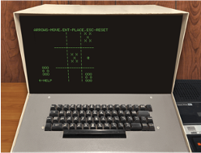
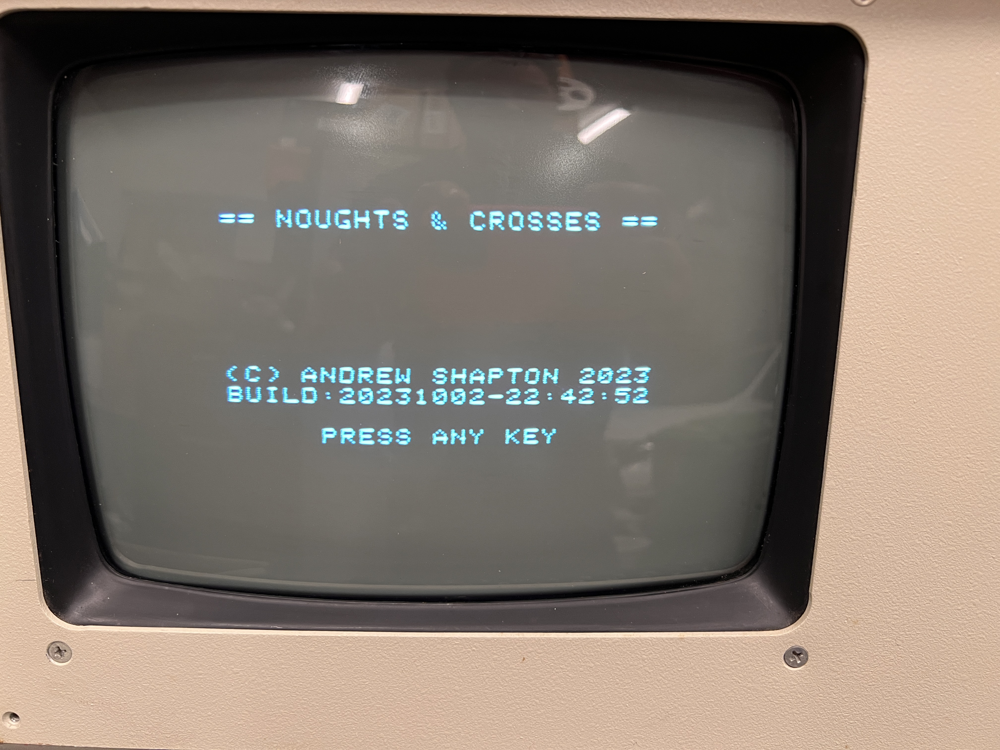
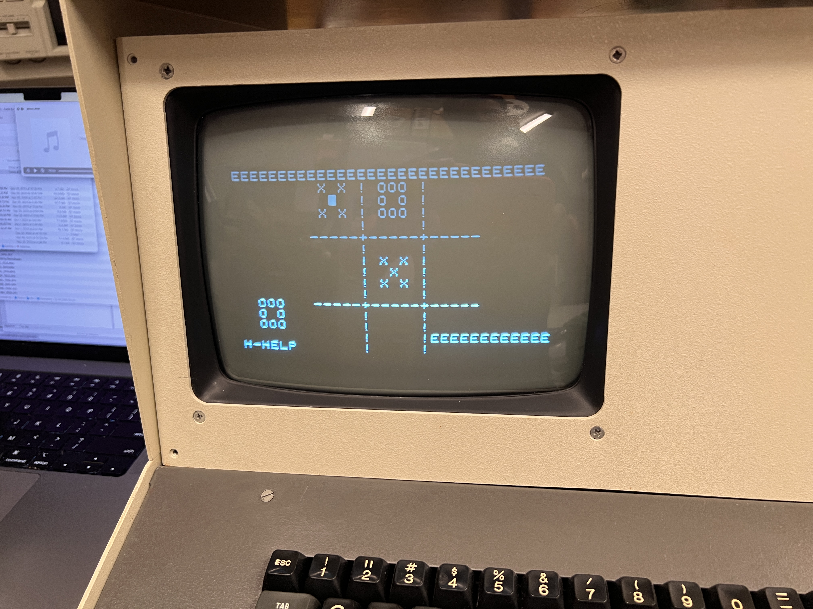

<h1 align="center">
	
</h1>

<h4 align="center">
	A Game of<br>OXO 
    <br>Tic-Tac-Toe<br>Noughts and Crosses
    <h3 align="center">for the Sphere-1</h3>
</h4>


<p align="center">
	
</p>

## Overview

- **Native 6800 Assembly code.** No requirement for a Sphere-1 BASIC ROM.
- **Play against your friend.** Challenge your friend to a skillful game.
- **Read about Noughts and Crosses [here](https://en.wikipedia.org/wiki/Tic-tac-toe)**


## Status
This game is a 1.1.2 release. 

There is a roadmap to other features for future releases [here](https://github.com/Sphere-Corporation/GAME-TT/milestones).

For an up-to-date list of tasks yet to complete, look at the [Issues](https://github.com/Sphere-Corporation/GAME-TT/issues) and engage with the community with the [Discussions](https://github.com/Sphere-Corporation/GAME-TT/discussions/20) area. 

Alternatively, if you have a suggestion for an improvement, please use the [Feature Request](https://github.com/Sphere-Corporation/GAME-TT/issues/new?assignees=alshapton&labels=feature%2Ctriage&projects=GAME-TT&template=feature_request.yml&title=%5BFeature%5D%3A+)

## Installation and Requirements

There are a number of prerequisites for downloading and running the game.

Which of the methods you use will depend on how you want to approach it, how experienced you are with assemblers, and what equipment you may or may not have.

All of the methods below require a method of running the game in either a virtual or physical Sphere-1 computer.

### Running from source

The prerequisites for this are:
 -  An MC6800 assembler available on the search path

 -  The [CONVERT tool](https://github.com/Sphere-Corporation/CONVERT) has been installed and is on the search path (follow the full instructions for its installation)

> Note that the assembler code is written to be compatible with the [SB-Assembler 3](https://www.sbprojects.net/sbasm/).


Clone the repo from GitHub, then run the build script:

```sh
git clone https://github.com/Sphere-Corporation/GAME-TT.git`
cd GAME-TT
./build --config config.toml
```
Prior to this, you must ensure that the paths to your source code, assembler and convertEXE tool are correctly defined in the appropriate toml configuration files. The lines to change are commented appropriately. **None of the other lines need to change unless you know what you are doing.**

**You may need to change the build script according to your environment as it is designed to run on a Unix-like environment**

### Different Assemblers

If you prefer to use your own/different assembler, please make the changes to the source file so you can assemble it, and add a section to the [ASSEMBLERS.md](doc/ASSEMBLERS/ASSEMBLERS.md) file describing what changes you needed to do to ensure it works. If you do this, and you find that it would be beneficial to others, please submit a Pull Request and store the code in a directory named as follows:

`src_<assembler_name>`

e.g.
`src_asm80`

Include a `README.md` file <u>in the directory</u> detailling any instructions that are pertinent to that assembler, such that anyone can understand how to assemble the code.

### Running the Game

However you decide to run this game, the following instructions are required:

i)	  `L OX/0200`			- to load the game from the cassette (either physical or virtual)

ii)   `<CTRL-D>`			- enter debug mode

iii)  `<CTRL-O> 0200`		- open the address of the program

iv)	  `<CTRL-G>`			- "Go" - run the program	


### In action!

Early version of the game running on a Sphere-1.

<p align="center">
	
	
</p>

<p align="center">
  
</p>

---

### Acknowledgements 

**Ben Zotto**<br>
Inspiration, a wealth of information, the image of the Sphere-1 used above, for running my software on his Sphere-1 hardware,and for alerting me to the Sphere-1 in the first place. Check out his ***extensive*** resources [here](https://sphere.computer).

